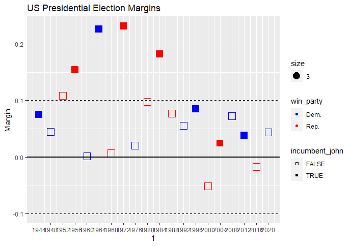
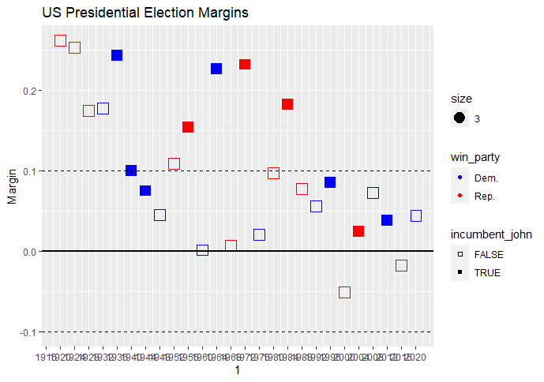
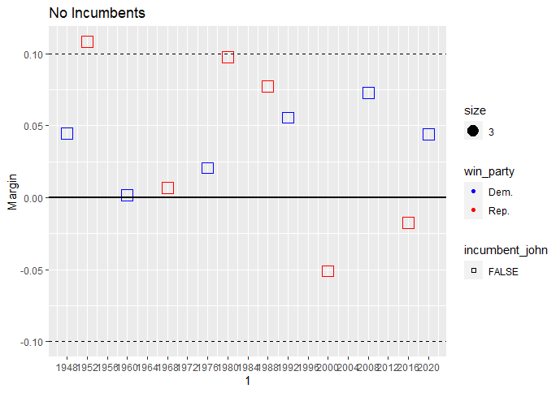

```{r setup, include=FALSE}
knitr::opts_chunk$set(echo = TRUE)
```

Presidential Elections in the United States of America have tended to be very close in recent memory. Why?

Since 1988, no US President has won the popular vote by more than a ten percent margin over a period of 8 elections. By contrast, 4 out of 9 UK elections since 1987 were won by a margin of more than ten percent. Furthermore, US elections weren't always this close. Between 1948 and 1984, 5 out of 11 elections were decided by a margin greater than ten percent. In fact, if we lower this margin to 9.7%, the majority of elections between 1948-1984 were decided by margins greater than ten percent.


  


##### Recent History (1948-2020)




##### Since Universal Suffrage (1920-2020)




### Wow. Thats a lot of landslides. What happened?

Hmm, what if we remove incumbents?


##### No Incumbents (1948-2020)




### Remove incumbents and landslides disappear

After removing incumbents, there are only two landslides. One is Dwight D. Eisenhower, a beloved war hero, who both parties tried to run as their candidate. [Truman offered to be his running mate](https://en.wikipedia.org/wiki/Draft_Eisenhower_movement#%22Eisenhower_Boom%22_(1948)), although he eventually ran as a Republican. The other is Ronald Reagan, a well known actor and former governor of California.


Personally, I think it's unfair to include Eisenhower. It's hard not to vote for the guy who was the Supreme Commander of the Allied Forces, eight years after he commanded the armies of the free world to victory against fascism.


